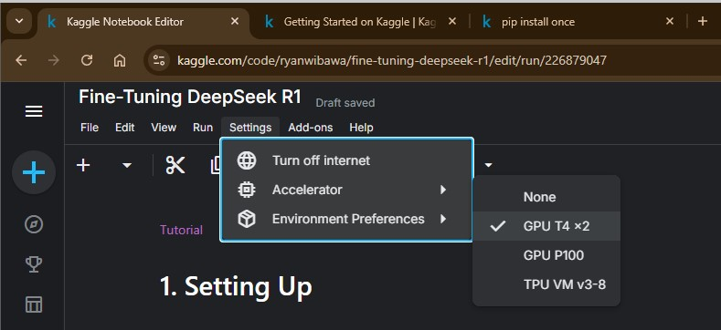
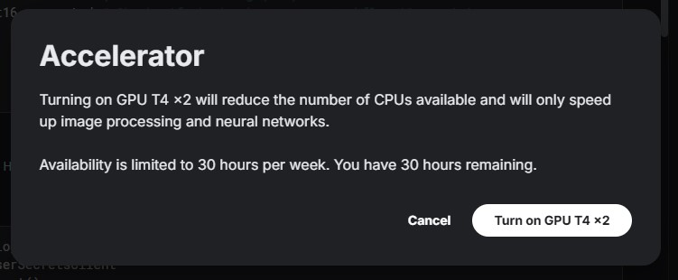
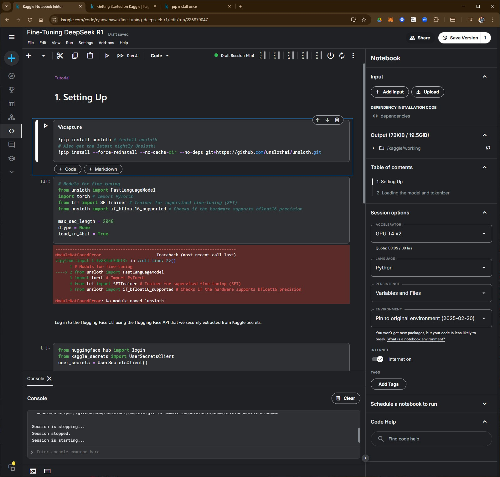
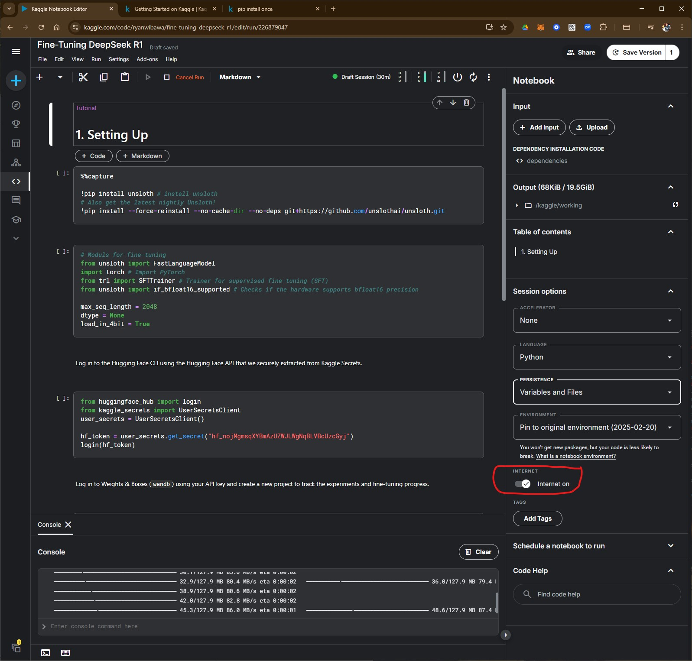
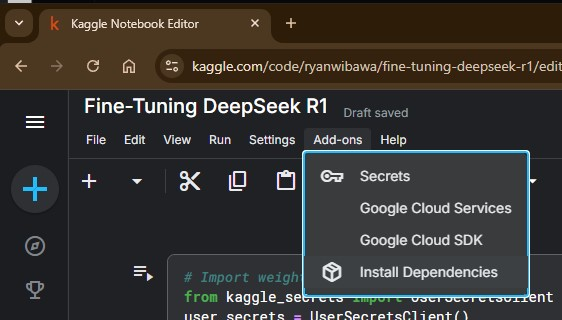
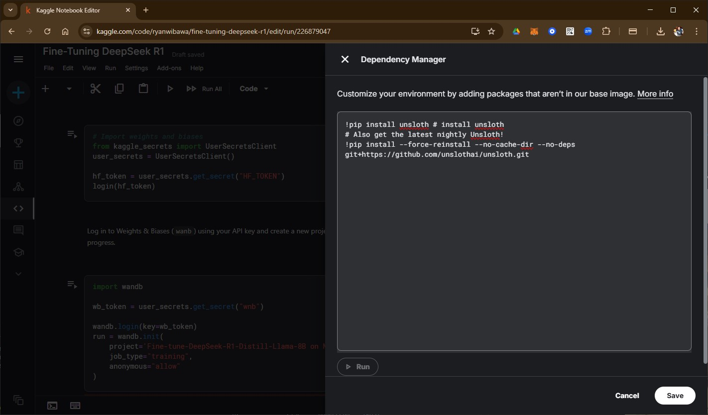
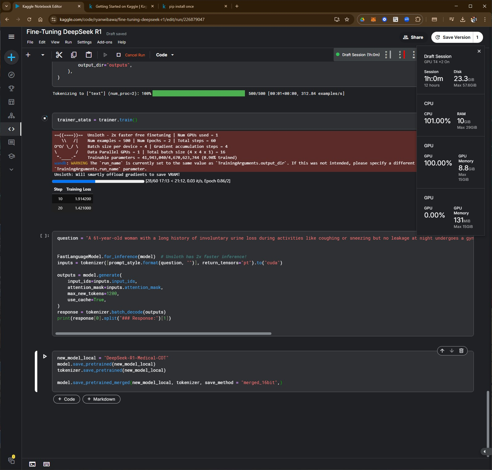

# kaggle notebook
* [note 01](https://www.kaggle.com/code/ryanwibawa/fine-tuning-deepseek-r1)

## 1. Run kernel on GPU
Go to **Settings > Accelerator > "GPU T4 x2"**

Acknowledge the setting:

Or select it on the notebook settings:

## 2. notebook settings
### 2.1. Turn the internet connection on.
To turn on the internet connection, go to _notebook settings_, then switch on the "internet on"

Later it can be turned off on the menu by going to **Settings > Turn internet off**

### 2.2 Option to save to the disk
Go to _notebook settings_ > Session options > Persistence > "Variables and Files".

## 3. Install dependecies
Go to **Settings > Add-ons > Install Dependencies**

Run the _pip install_ command(s) here:

## 4. The training progress

